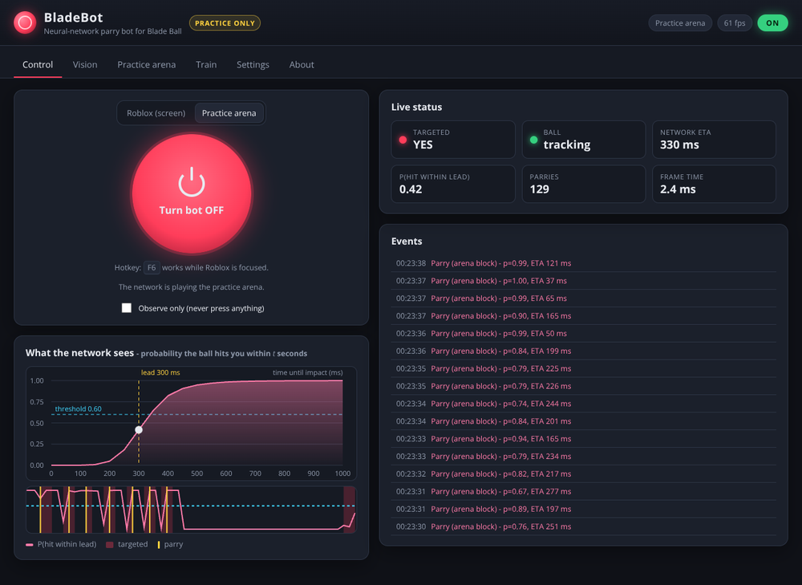

# BladeBot: a neural-network parry bot for Roblox Blade Ball

> [!WARNING]
> **BladeBot is for practice only.**
> Use it in the built-in offline **practice arena**, in Blade Ball's **training / practice modes**, or in
> **private servers where everyone knows and agrees**. **Never use it in public or ranked matches.**
> Automating gameplay can break Roblox's Terms of Use and the game's rules, it spoils the game for other
> players, and it **can get your account banned**. You are responsible for how you use it.

BladeBot is a desktop program that watches your screen, uses a **neural network** to predict when the red
ball will reach your character, and blocks at the right moment. You control it from a **menu in your
browser**: one big ON/OFF button, a live view of what the network sees, calibration tools, a practice
arena and a training tab.

It is also a timing coach. In the practice arena you can play yourself, and after every ball it tells you
how early or late you blocked and when the network would have pressed.



---

## Contents

- [Practice use only](#practice-use-only)
- [Features](#features)
- [How it works](#how-it-works)
- [Installation](#installation)
- [Quick start: the practice arena (no Roblox needed)](#quick-start-the-practice-arena-no-roblox-needed)
- [Using BladeBot in a Blade Ball practice session](#using-bladebot-in-a-blade-ball-practice-session)
- [The menu](#the-menu)
- [Tuning](#tuning)
- [Training your own network](#training-your-own-network)
- [Results](#results)
- [Project layout](#project-layout)
- [Development](#development)
- [Troubleshooting](#troubleshooting)
- [Disclaimer](#disclaimer)

---

## Practice use only

BladeBot is meant to help you **practise and learn parry timing**. Please stick to these rules:

| ✅ OK | ❌ Not OK |
| --- | --- |
| The built-in practice arena (fully offline) | Public servers and matchmaking |
| Blade Ball's training / practice modes | Ranked or competitive games |
| Private servers where every player knows you are testing a bot and is fine with it | Using it against players who don't know about it |
| Watching the network in *observe only* mode to learn timing | Selling, streaming or advertising it as a cheat |

- The program shows a **practice-only notice** that you must accept before the bot can run on the real
  game. You can withdraw your acceptance at any time on the *About* tab.
- BladeBot does **not** modify, inject into or read the memory of Roblox. It only looks at the screen
  and presses your block key, the same way you would. It has **no anti-detection features**, and
  Roblox and game developers can still detect and ban automated input. The decision and the risk
  are yours.
- BladeBot is an independent project and is **not affiliated with, endorsed by or connected to Roblox
  Corporation or the Blade Ball developers**.

---

## Features

- **Neural network timing.** A small multilayer perceptron (pure NumPy) predicts the probability
  that the ball reaches you within 0.05, 0.10, … 1.0 s. It blocks once per ball, when the chance of
  impact within your *lead time* passes a threshold.
- **Browser menu.** It runs locally at `http://127.0.0.1:8765` and has an ON/OFF button, a global
  hotkey (F6), a live probability chart, event log, calibration tools, settings, training and an
  about page.
- **Screen vision.** It finds Blade Ball's "targeting red" ball, checks whether *your* character
  is highlighted red (which means the ball is coming for you) and ignores everything else.
- **Practice arena.** An offline 3-D simulator of a Blade Ball rally. You can let the network play or
  practise yourself (Space to block) and get feedback on every ball.
- **Observe-only mode.** The bot shows when it *would* block but never presses anything.
- **Training tab.** Train a new network from the menu in about a minute. You can optionally
  fine-tune it on your own recorded practice sessions.
- **Safe defaults.** The menu is only reachable from your own PC. Presses are rate-limited and
  happen once per approach. The bot only reacts while you are targeted.

---

## How it works

```
 screen ──► capture ──► vision ──► tracking ──► neural network ──► decision ──► press F / click
  (mss)      70%×80%    red ball    19 features    P(hit within t)     one press
             of screen  + "am I     per frame      for 20 horizons     per ball
                        targeted?"
```

1. **Capture.** `mss` grabs the middle part of your monitor (the size is adjustable) up to 120 times
   per second.
2. **Vision** (`bladebot/vision.py`).
   - Every pixel is classified with a colour lookup table ("is this targeting red?").
   - Red pixels are grouped into blobs, and the ball is the round, solid blob.
   - A box around your character checks whether you are highlighted red. Blade Ball does this
     while the ball targets you. The box is also cut out of the search, so your own red outline is
     never mistaken for the ball.
3. **Tracking** (`bladebot/features.py`).
   - The last detections are fitted over time (recency weighted).
   - This gives 19 features:
     - how fast the ball grows on screen ("looming", which is 1/time-to-contact) and how fast
       that rate itself rises
     - its position and speed relative to your character
     - its size compared to your character (how far away it is)
     - how zoomed out the camera is
     - how fresh the track is
4. **Neural network** (`bladebot/model.py`, `bladebot/nn.py`).
   - A 19 → 64 → 64 → 20 tanh MLP (6,740 weights, a 28 KB file) outputs
     `P(ball hits me within 0.05 s)`, `… within 0.10 s`, …, `… within 1.0 s`.
   - The outputs are forced to be monotone, so they form a proper distribution of the arrival
     time. That gives an ETA as well as a confidence.
5. **Decision** (`bladebot/engine.py`).
   - When `P(hit within lead time) ≥ confidence` for a couple of frames (or instantly above a
     higher threshold), the bot presses once for that approach.
   - If the ball disappears (usually behind your own character, just before it hits), waiting
     gains nothing. The bot then presses as soon as the ball will likely arrive within the 0.5 s
     the shield lasts.
   - It then waits until the targeting ends. If you are still targeted after the 2 s whiff
     cooldown, it allows one retry.

**Training data** (`bladebot/sim/`, `bladebot/training.py`).
- The network is trained on tens of thousands of simulated approaches in a small 3-D model of the
  game. Each one has a random:
  - ball speed (20–350 studs/s), start position, curve and homing strength
  - camera distance, pitch, field of view and shift-lock
  - frame rate (30–144 FPS) and capture size
- The simulated vision adds realistic problems: noise, missed frames, glow, and the ball
  disappearing behind your character.
- Because the simulator knows the exact moment of impact, every frame gets a perfect label.
- You can add your own recordings. The end of each red "targeted" period is treated as the impact
  (hindsight labelling).

---

## Installation

You need **Python 3.9 or newer** (3.11+ recommended) and a PC that can run Roblox. The main target is
Windows 10/11. macOS should work, but it is not the primary test platform.

### Windows (easiest)

1. Install Python from <https://www.python.org/downloads/>. Tick **"Add python.exe to PATH"**.
2. Download this repository: *Code → Download ZIP*, or `git clone`.
3. Double-click **`start.bat`**.

The first start creates a virtual environment and installs the requirements. After that, the menu
opens in your browser.

### macOS / Linux

```bash
git clone https://github.com/benluvzbacon/Bladeball-bot.git
cd Bladeball-bot
./start.sh
```

On macOS you must allow your terminal under *System Settings → Privacy & Security* in two places:
**Screen Recording** (to capture the screen) and **Accessibility** (for the hotkey and key presses).

### Manual

```bash
python -m venv .venv
# Windows: .venv\Scripts\activate    macOS/Linux: source .venv/bin/activate
pip install -r requirements.txt
python run.py            # or: python -m bladebot
```

Dependencies are `numpy`, `mss` (screen capture) and `pynput` (hotkey, and key presses on
macOS/Linux). On Windows, key presses use the built-in `SendInput` API.

### Command-line options

| Option | Meaning |
| --- | --- |
| `--port 8765` | Port of the menu (use another one if 8765 is taken) |
| `--host 127.0.0.1` | Address of the menu. The default is only reachable from your own PC. **Only change this on a network you trust.** |
| `--no-browser` | Don't open the menu automatically |
| `--no-hotkey` | Disable the global on/off hotkey |
| `--source arena` | Start with the practice arena selected |
| `--settings FILE` | Use another settings file (default `settings.json`) |

---

## Quick start: the practice arena (no Roblox needed)

1. Start BladeBot. The menu opens at <http://127.0.0.1:8765>.
2. Open the **Practice arena** tab. The source switches to the arena automatically.
3. **Neural network plays.** Press **Turn bot ON** on the *Control* tab (or F6) and watch the
   network block. The *Control* tab shows its probability curve and every decision live.
4. **I play.** Switch to *I play* and press **Space** (or the BLOCK button) just before the ball
   reaches you. After each ball you get feedback like *"Perfect timing! The ball arrived 221 ms after
   your shield went up… The network would have pressed with 285 ms to go."*

The arena follows Blade Ball's rules:
- The shield lasts 0.5 s. Blocking too early costs a 2 s cooldown.
- The ball speeds up with every block.
- Other players glow red when the ball targets them. These are decoys that the bot must ignore.

---

## Using BladeBot in a Blade Ball practice session

> Only in practice / training modes or private servers where everyone agrees. See
> [Practice use only](#practice-use-only).

1. **Start Roblox** in windowed or borderless mode on your main monitor and join a practice session.
2. **Start BladeBot** and choose **Roblox (screen)** on the *Control* tab.
3. **Calibrate** on the *Vision* tab. The preview only runs while this tab is open.
   - *Click = my character*, then click your character in the preview. The cyan cross should sit
     on its body.
   - Adjust **Character box width/height** so the yellow box **just covers your whole
     character**. The box is cut out of the ball search, and the network uses its size to judge the
     camera zoom.
   - Get targeted by the ball. The yellow box must turn **red**, and the ball must get a **green
     circle**. If the ball is not picked up, choose *Click = ball colour* and click the red ball
     while it is coming at you.
   - Zoom the camera out a little, or tilt it down, so the ball is not hidden behind your character
     for too long.
4. **Check your controls** on the *Settings* tab. The default parry input is the **F** key; you can
   switch to *Left mouse click*. The on/off hotkey is **F6**.
5. **Try observe-only first.** Tick *Observe only*, turn the bot on and watch the *WOULD PARRY*
   flashes and the event log while you play normally.
6. **Turn it on.** Untick *Observe only* and press **Turn bot ON** (or F6 while Roblox is focused).
   The first time, you have to accept the practice-only notice. A high beep means on and a low beep
   means off (Windows).

Keep the Roblox window visible (not minimised or covered). The bot only reacts while your character
is highlighted red. You can switch that check off under *Targeting check*, but it is not recommended.

---

## The menu

| Tab | What it's for |
| --- | --- |
| **Control** | ON/OFF button, source (Roblox or arena), observe-only switch, live status (targeted, ball, ETA, probability, frame time), the network's probability curve with your lead time and threshold, a 6-second timeline with every parry, and an event log. |
| **Vision** | Live camera preview showing the detected ball, the red mask and the character box. Click to set your character position or pick the ball colour. Also holds the capture region, colour and shape filters, and the targeting check. |
| **Practice arena** | The offline simulator. The network plays or you play, with a scoreboard, timing feedback and arena settings (ping, speed, speed-up, camera, decoys). |
| **Train** | Info about the current network. Train a new one, go back to the bundled one, and record practice sessions. |
| **Settings** | Parry timing (lead time, thresholds, re-arm, retry) and controls (key, click, hold time, hotkey, FPS limit, beep). |
| **About** | The practice-only notice and how the bot works. |

Settings are saved to `settings.json` next to the program. Each group has a *Reset* button.

---

## Tuning

| Symptom | Try |
| --- | --- |
| The ball hits you before the bot blocks | Raise **Parry lead time** (e.g. 300 → 360 ms), lower **Confidence threshold**, raise **Max FPS**, check your ping |
| The bot blocks too early (cooldown, then hit) | Lower **Parry lead time**, raise **Confidence threshold** |
| It never reacts | Check the *Vision* tab: does the box turn red when you are targeted? Does the ball get a circle? Re-pick the ball colour |
| It reacts to other red things | Keep *Only parry while I'm highlighted red* on, shrink the capture region, raise **Minimum roundness** |
| Very fast balls get through | Lower **Instant-parry confidence** or set **Confirm frames** to 1 |
| High CPU usage | Lower **Max FPS** or raise **Downscale** to 3 |

A rule of thumb: lead time ≈ 240 ms + your ping.

---

## Training your own network

The repository ships with a trained network (`models/parry_net.npz`). To train a new one:

- **From the menu** (*Train* tab):
  1. Choose the number of simulated approaches, epochs and layer sizes.
  2. Press **Start training**. 12,000 approaches take about a minute.
  3. The result is saved as `models/custom_parry_net.npz` and used right away.
  4. **Use bundled model** switches back.
- **From the command line:**

  ```bash
  python -m bladebot.training --approaches 40000 --epochs 40              # writes models/parry_net.npz
  python -m bladebot.training --approaches 8000 --out models/custom_test.npz --hidden 32,32
  python -m bladebot.training --recordings --approaches 20000             # also learn from recordings
  python -m bladebot.training --help
  ```

**Learning from your own practice sessions.**
1. On the *Train* tab, press **Start recording** and play normally (practice mode or arena).
2. BladeBot writes the detections and the "am I targeted" signal to `recordings/*.jsonl`. It does
   not save screenshots.
3. Each time the red targeting ends, it knows the ball arrived. Every earlier frame of that approach
   gets a time-to-impact label.
4. Tick **Also learn from my recordings** and train. Recorded frames are mixed with simulated data.

After training, the report compares the network with a classic "looming" formula on held-out
simulated approaches, including a breakdown by ball speed.

---

## Results

These numbers are measured on the bundled network. They come from the simulator and arena, not from
live Roblox matches. Real results depend on calibration, ping, frame rate and graphics settings.

**Held-out simulated approaches** (lead 300 ms, confidence 0.6, 60 ms input latency):

| | Parry success | Too early | Too late | Presses on decoys |
| --- | --- | --- | --- | --- |
| **Neural network** | **85.8 %** | 3.4 % | 9.9 % | 1.6 % |
| Classic looming formula | 61.7 % | 15.3 % | 14.9 % | 10.0 % |

Time-to-impact error was about 80 ms. By ball speed, the network blocked 90 % at 0–60 studs/s,
92 % at 60–150 and 72 % above 150.

**Practice arena, network playing**
- It blocked 94.5 % of balls over 6 minutes (375 blocks, 22 hits, 2 early presses).
- The best streak was 24 blocks, with ball speeds up to 228 studs/s.
- At a constant slow speed it blocked 95 % at 30 studs/s and 91 % at 22 studs/s. Very slow balls
  are its weak spot: 77 % at 15 studs/s.
- The frames go through exactly the same vision → tracking → network → decision code as on the real
  screen.
- Vision, network and decision together take about 2.5 ms per frame.

---

## Project layout

```
bladebot/
  app.py          command line entry point (starts engine, hotkey and menu)
  server.py       local web server + JSON API for the menu
  web/            the menu (index.html, app.js, style.css; no build step)
  engine.py       main loop: capture -> vision -> network -> decision -> input
  vision.py       red-ball detection, targeting check, preview drawing
  features.py     tracking + the 19 features the network reads
  nn.py           tiny NumPy neural-network library (MLP, Adam, BCE)
  model.py        ParryNet: the time-to-impact network
  training.py     dataset generation, training, evaluation, CLI
  recorder.py     practice-session recordings (JSONL)
  capture.py      screen capture (mss)
  controller.py   key / mouse presses (SendInput on Windows, pynput elsewhere)
  hotkeys.py      global on/off hotkey
  config.py       all settings with limits and help texts
  pngenc.py       small PNG encoder for the preview
  sim/            3-D approach simulator, renderer and practice arena
models/parry_net.npz   the bundled trained network
tests/                 pytest suite (no screen or Roblox needed)
start.bat / start.sh   one-click launchers
```

---

## Development

```bash
pip install -r requirements-dev.txt
python -m pytest
```

The tests use synthetic images, the simulator and the arena, so they run anywhere (no display
needed). They cover:
- the neural network (gradient checks), features and vision
- the arena rules and the training pipeline
- the decision logic, the engine thread and the web API
- an end-to-end check that the bundled network actually blocks in the arena

---

## Troubleshooting

- **The menu doesn't open.** Open <http://127.0.0.1:8765> yourself. If the port is taken, start with
  `--port 8766`.
- **"Screen capture" error / black preview.** Use windowed or borderless mode instead of exclusive
  fullscreen. On macOS, give your terminal *Screen Recording* permission. Check the **Monitor**
  setting if you have several screens.
- **The hotkey doesn't work.**
  - Some games and apps swallow keys. Try another hotkey on the *Settings* tab.
  - On macOS, give your terminal *Accessibility* permission.
  - You can always use the menu button.
- **Blocks don't register in Roblox.**
  - Make sure the parry key matches your Blade Ball keybind (default F) and that Roblox is the
    focused window.
  - Some setups need BladeBot to run with the same privileges as Roblox. If Roblox runs as
    administrator, so must BladeBot.
- **The ball is detected in the preview, but the box never turns red.** Make the character box
  cover your character, or lower *Red needed in box*. If your character's red highlight looks
  different, click it with *Click = ball colour* and widen *Hue tolerance*.
- **Linux: `pip install pynput` fails while building `evdev`.** Run
  `pip install --no-deps pynput python-xlib six`. The X11 backend is enough.

---

## Disclaimer

This software is provided for **educational and practice purposes only**, without any warranty. Using
automation in online games may violate the game's rules and the Roblox Terms of Use and may lead to
penalties, including account bans. The authors are not responsible for any consequences of using it.
Roblox and Blade Ball are trademarks of their respective owners. This project is not affiliated with
them.
